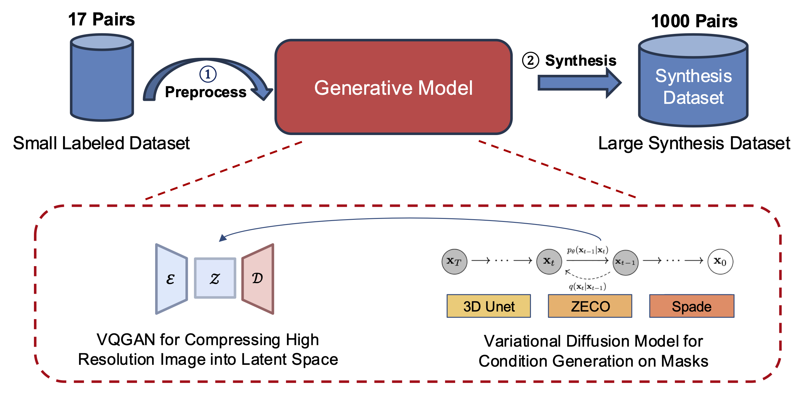
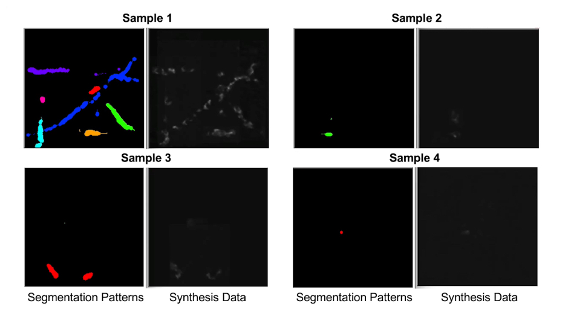
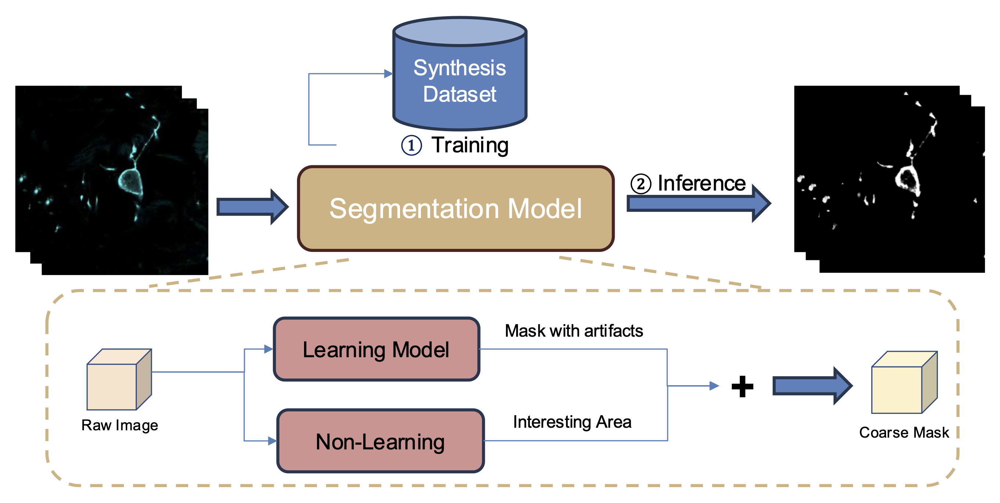

# 

&nbsp;

  

[Project Webpage](https://brack-wang.github.io/brainbow_webpage/index.html) 

<h2> A Unified Framework for Unsupervised Sparse-to-dense Brain Image Generation and Neural Circuit Reconstruction  </h2> 

  

       This research is supported by NSF IIS-2525840 and NIH 1RF1MH133764-01.
     

&nbsp;
We propose "A Unified Framework for Unsupervised Sparse-to-Dense Brain Image Generation and Neural Circuit Reconstruction". The framework consists of three key stages: (1) a Generative Model to expand datasets by synthesising large number of neuron images with labels, (2) a Segmentation Model to identify neurons and create coarse segmentation masks, and (3) an Interactive Platform to enhance segmentation quality through expert feedback, rapidly producing accurate labels and improving the segmentation model through continuous learning. Our unified framework has demonstrated its effectiveness in synthesizing large datasets from sparse inputs, enabling accurate segmentation on unseen data. 

### If you find this repo useful, please give it a star ⭐. Thank you!

# Generation

We developed a latent diffusion-based generative model combined with our ZECO Module.

With sparse labeled data for training, our generative model generates 1,000 synthetic images that capture both the morphology and spatial distribution of neurons, guided by segmentation patterns.

# Segmentation

We introduced a combined strategy that integrates fine-tuning a foundation model (SegNeuron) on our synthetic dataset and a non-learning method to focus on the interesting areas, enabling high-quality segmentation masks on unseen data.

 We evaluated our segmentation model on out-of-domain data, achieving promising and accurate segmentation results with minimal artifacts.

# Acknowledgements
Our code is based on the following awesome repositories:
- [Generative Model - MONAI](https://github.com/Project-MONAI/GenerativeModels) 
- [Segmentation Model - SegNeuron](https://github.com/yanchaoz/SegNeuron)  
We thank the authors for releasing their code!
